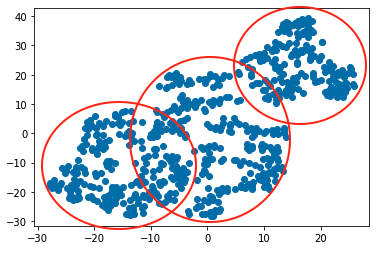
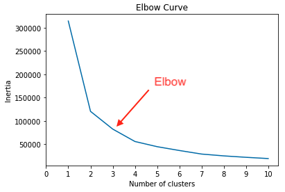

# Myopia Clusters

Prepared by Corey Lawson-Enos

## Summary
* An unsupervised machine learning model in scikit-learn used to determine if distinct clusters are apparent amongst a patient dataset that might warrant separate study and predictor models.

## Technologies
Pandas, Scikit-learn, NumPy, Matplotlib, Jupyter Notebook

## Access
* Data source: 'myopia.csv' file saved to Resources folder in this repository. 
* Use 'Myopia Clusters.ipynb' Jupyter Notebook in this repository to recreate study.

## Method
* Dataset is scaled and dimensionality reduction applied using PCA, while preserving 90% of the explained variance. Dimensions are further reduced using t-SNE. The output is plotted for visual analysis, and a cluster analysis is performed with K-means.

## Analysis & Recommendation
* Visually, there appear to be two to three clusters, although they are not completely distinct. Suggested outlines as follows:

* Per the following elbow curve plotted using K-means cluster analysis, three clusters to the data are also suggested:

* Recommendation: This unsupervised learning model demonstrates that apparently three clusters exist in the dataset. For future analysis, use the "MYOPIC"--myopia diagnosis--feature of the dataset for labels/color on the scatter plot. Coloring by myopia diagnosis may show if there is tendency toward the condition amongst the three patient clusters observed. This added color analysis may support the suggestion that sub-categories of the patients exist which warrant separate predictor models.

## Source

* Reduced dataset from 

## Contact
E-mail: clawson131@gmail.com 
LinkedIn: https://www.linkedin.com/in/corey-lawson-enos/
